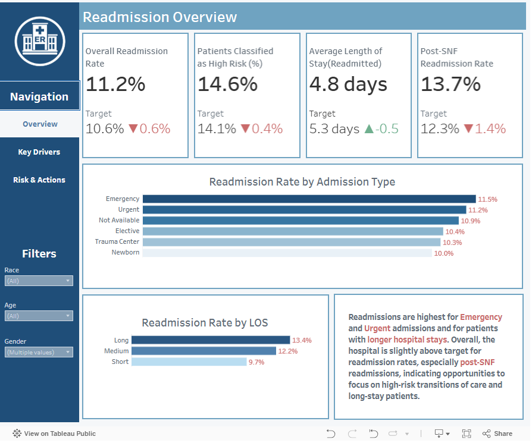
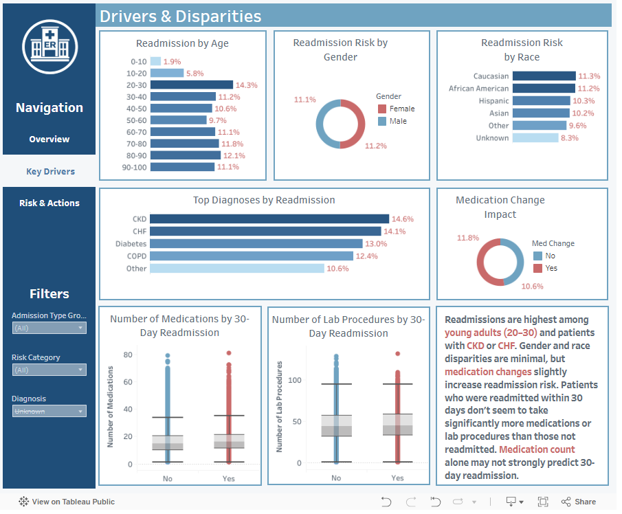
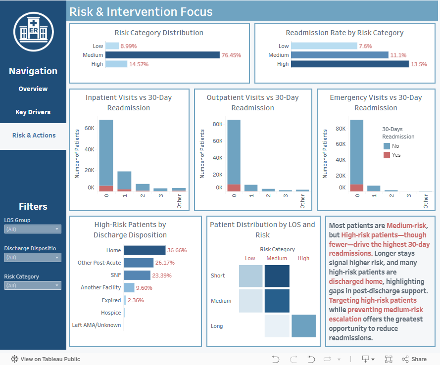

# Hospital Readmission Analysis
**Tableau Public Dashboard:**

https://public.tableau.com/views/HospitalReadmissionAnalysis

## Project Overview

Hospital readmissions are a critical metric for patient outcomes, quality of care, and healthcare costs. This project analyzes hospital readmissions using patient demographics, diagnoses, hospital stay characteristics, and post-discharge factors to identify key drivers of 30-day readmissions.
The analysis leverages Python, SQL, and Tableau to provide actionable insights for improving patient care and reducing unnecessary readmissions.

## Key Questions

1. What factors most influence 30-day hospital readmissions?

2. Which patient groups (age, gender, race) are at higher risk of readmission?

3. How do clinical conditions and comorbidities drive readmissions?

4. How do hospital stay characteristics (length of stay, admission type, discharge disposition) impact readmission rates?

5. Which high- and medium-risk patients should hospitals target for post-discharge interventions to reduce readmissions?

## Dataset
This analysis uses a hospital dataset from Kaggle(https://www.kaggle.com/datasets/pavan2029/diabetic-data?select=diabetic_data.csv) containing patient demographics, admission details, clinical conditions, lab procedures, medications, and 30-day post-discharge readmissions.

## Data Cleaning & Preprocessing

- Removed duplicates and invalid entries.

- Standardized column names and types.

- Encoded categorical variables for analysis.

- Handled missing values using domain-appropriate methods.

## Project Structure

```text
hospital-readmission-analysis/
│
├── data/
│   ├── raw/                                                         # Original, unmodified source CSV files
│   ├── stage/                                                       # Intermediate datasets (cleaning, feature prep, validation)
│   └── processed/                                                   # Final clean datasets used for analysis & visualization
│ 
├── notebooks/
│   ├── 01_readmissions_generate_sql_insert_from_csv.ipynb           # Generates SQL INSERT statements from raw CSV data
│   │                                                                # Used to load data into the database reproducibly
│   │                                                                
│   └── 03_readmissions_eda_tableau_prep.ipynb                       # Exploratory data analysis (EDA)
│                                                                    # Feature engineering and preparation for Tableau dashboards
│
├── sql/
│   ├── 02_1_create_diabetes_readmissions_raw.sql                    # Creates raw database tables (no transformations applied)
│   ├── 02_2_insert_diabetes_readmission_raw.sql                     # Inserts raw CSV data into raw tables
│   ├── 02_3_create_diabetes_readmissions_clean.sql                  # Creates cleaned / analytics-ready tables
│   ├── 02_4_insert_diabetes_readmissions_clean.sql                  # Transforms and loads data from raw to clean tables
│   ├── 02_5_analytical_queries.sql                                  # Analytical SQL queries for insights and validation
│   ├── 02_6_analytical_queries.sql
│   ├── 02_7_analytical_queries.sql
│   ├── 02_8_analytical_queries.sql
│   └── 02_9_analytical_queries.sql
│
├── images/                                                          # Screenshots, charts, and visual assets for README
├── dashboards/                                                      # Tableau dashboards(.twbx)
│
├── requirements.txt                                                 # Dependencies for notebooks and scripts
│
└── README.md                                                        # Project overview, methodology, insights, and results
```

## Tools & Technologies

- Python: pandas, numpy, matplotlib, seaborn

- SQL 

- Tableau: Data visualization dashboards

- Excel: Basic data checks and summary tables


## Key Takeaways

1. Admission Type & Length of Stay:
 Emergency and urgent admissions, as well as longer hospital stays, are associated with the highest 30-day readmission rates.


2. High-Risk Populations:
 Young adults (20–30) and patients with CKD or CHF are particularly prone to readmissions.

3. Minimal Demographic Disparities:
 Gender and race show little impact on readmission rates, though medication changes slightly increase risk.

4. Medication & Lab Procedures:
 Patients readmitted within 30 days do not consistently take more medications or undergo more lab procedures than others, indicating medication count alone is a weak predictor.

5. Risk Stratification & Post-Discharge Support:
 High-risk patients drive most readmissions, especially when discharged home after long stays. Focusing on high-risk patients and preventing medium-risk escalation offers the biggest opportunity to reduce readmissions.

## Data Notes

The full Hospital Readmissions dataset is very large and not included in this repository to keep it manageable and secure. You can download it from https://www.kaggle.com/datasets/pavan2029/diabetic-data?select=diabetic_data.csv.

The repository contains a sample dataset (data/source/readmission_raw_data_sample.csv) sufficient to run all notebooks and reproduce analysis.

Columns, structure, and preprocessing are consistent with the full dataset.

To run the analysis on the full dataset, download it from the official source and place it in data/raw/. Update file paths in notebooks and SQL scripts accordingly.

Why a sample is used:

Large datasets (>100 MB) can break GitHub or slow down version control.

Protects privacy and compliance with data-sharing rules.

Allows recruiters and collaborators to quickly explore project logic without needing huge downloads.

## How to Run

1. Clone the repository:
```text
git clone https://github.com/yourusername/hospital_readmission_analysis.git
```
2. Move to project directory
```text
cd hospital_readmission_analysis
```
3. Create and activate a virtual environment
```text
python -m venv venv && venv\Scripts\activate
```
4. Install dependencies
```text
pip install -r requirements.txt
```
5. Open Jupyter Notebook
```text
jupyter notebook
```
6. Run notebooks in this order

- 01_readmissions_generate_sql_inserts_from_csv.ipynb
- 02_readmissions_data_transformation.ipynb
- 03_readmissions_eda_tableau_prep.ipynb

7. Open Tableau dashboards in reports/dashboards/.

## Dashboards





## Author

Tatsiana Rudkouskaya
Data Analyst | Healthcare Analytics | Data Visualization


